# PR Auto Reviewer - 아키텍처 문서

## 개요

PR Auto Reviewer는 GitHub Pull Request의 리뷰 댓글을 자동으로 분석하고, AI를 사용해 코드를 수정한 뒤, 커밋/푸시하고 댓글에 답변하는 자동화 도구입니다.

## 시스템 아키텍처

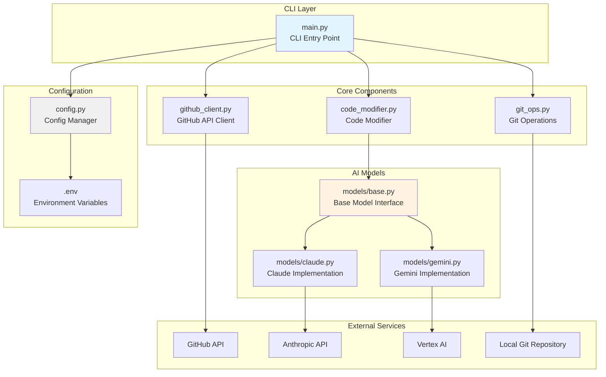

## 워크플로우

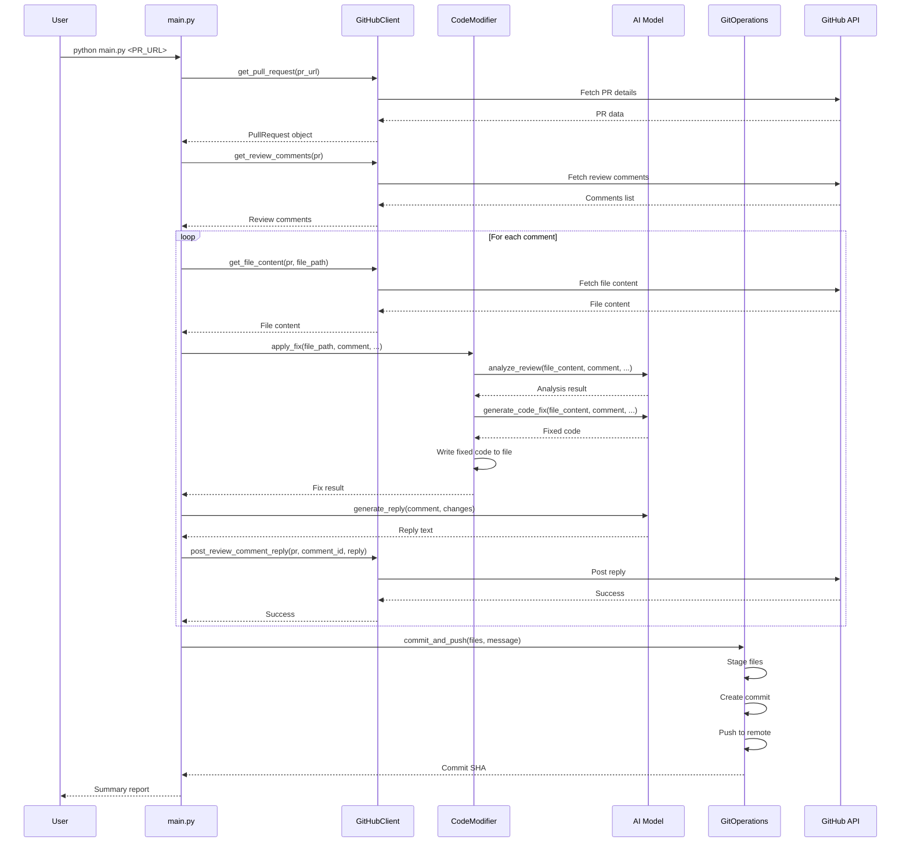

## 컴포넌트 상세

### 1. CLI Layer (main.py)

사용자 인터페이스를 제공하고 전체 워크플로우를 조율합니다.

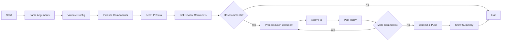

**주요 기능:**
- CLI 인자 파싱 (Click)
- 진행 상황 표시 (Rich)
- 컴포넌트 초기화 및 조율
- 에러 핸들링

### 2. GitHub Client (github_client.py)

GitHub API와 상호작용하는 모든 로직을 담당합니다.

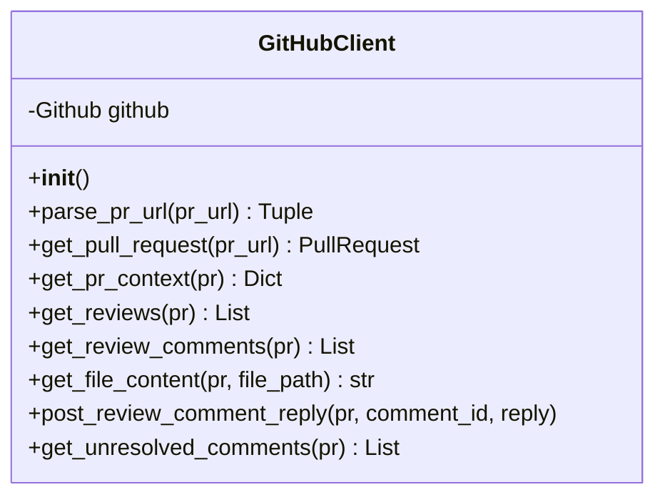

**책임:**
- PR URL 파싱
- PR 정보 및 리뷰 댓글 조회
- 파일 내용 가져오기
- 댓글에 답변 작성

### 3. AI Models

AI 모델의 공통 인터페이스와 구현체들입니다.

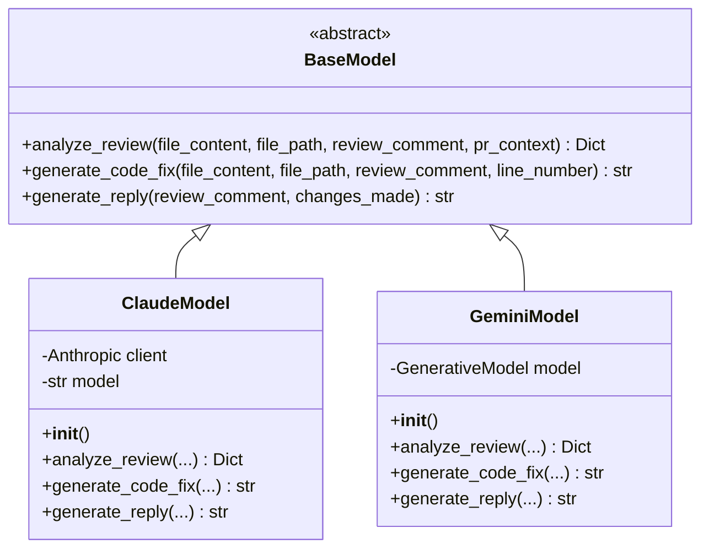

**AI 모델의 역할:**

1. **analyze_review**: 리뷰 댓글을 분석하고 필요한 작업 결정
   - Input: 파일 내용, 리뷰 댓글, PR 컨텍스트
   - Output: 액션 타입, 변경 사항 리스트, 이유

2. **generate_code_fix**: 실제 코드 수정 생성
   - Input: 파일 내용, 리뷰 댓글, 라인 번호
   - Output: 수정된 파일 전체 내용

3. **generate_reply**: 리뷰 댓글에 대한 답변 생성
   - Input: 리뷰 댓글, 변경 사항 설명
   - Output: 답변 텍스트

### 4. Code Modifier (code_modifier.py)

AI 모델을 사용해 실제 파일을 수정하는 로직입니다.

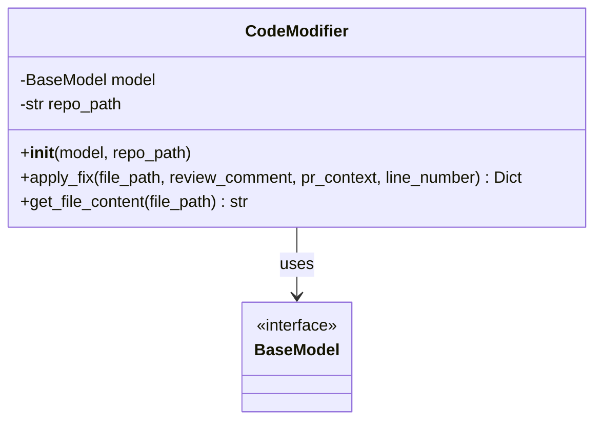

**프로세스:**
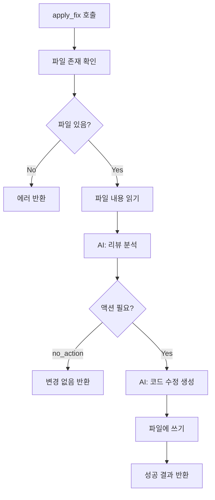

### 5. Git Operations (git_ops.py)

Git 작업을 자동화합니다.

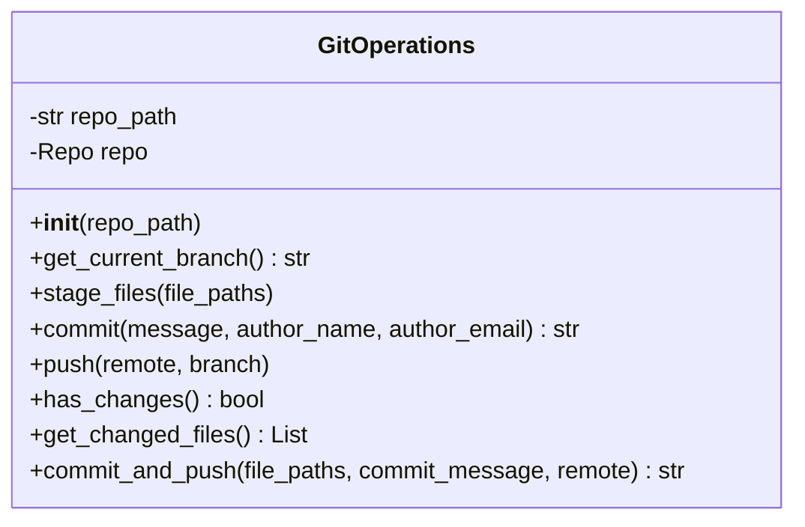

**작업 흐름:**


### 6. Configuration (config.py)

환경 변수를 관리하고 검증합니다.

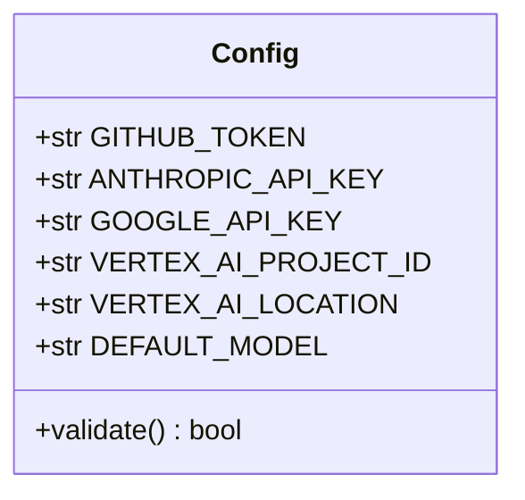

## 데이터 플로우

### PR 정보 처리

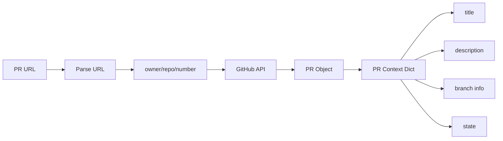

### 리뷰 댓글 처리

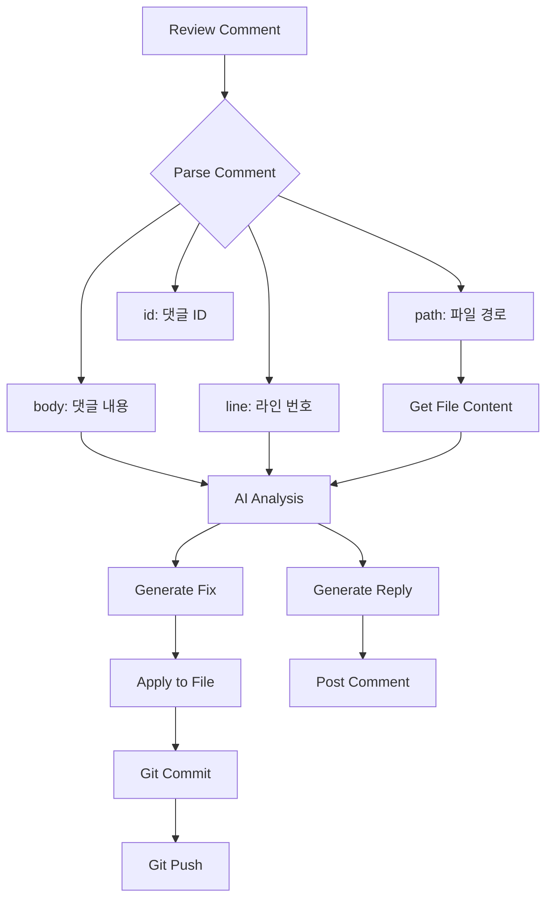

## 에러 처리 전략

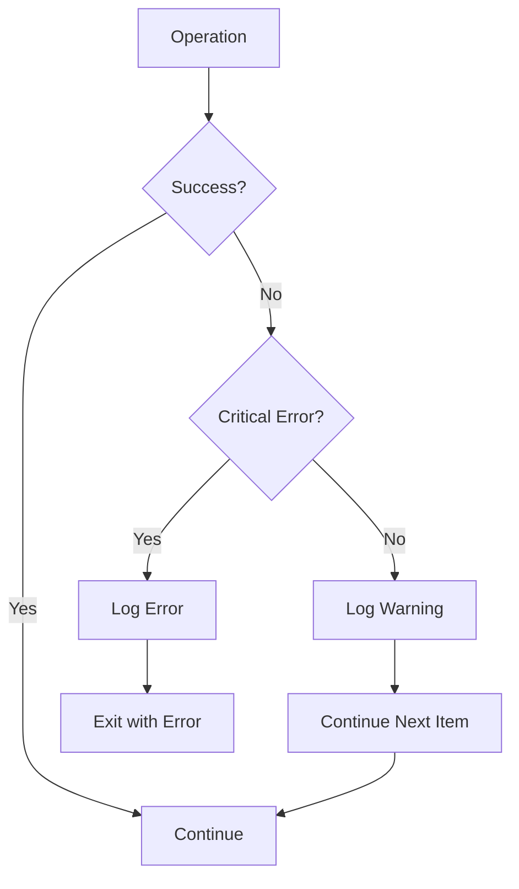

**에러 타입:**
- **Configuration Error**: 즉시 종료 (API 키 없음, 잘못된 설정)
- **GitHub API Error**: 재시도 또는 종료 (인증 실패, 권한 없음)
- **File Not Found**: 해당 댓글 스킵, 계속 진행
- **AI Model Error**: 해당 댓글 스킵, 계속 진행
- **Git Error**: 종료 (커밋/푸시 실패)

## 확장 포인트

### 1. 새로운 AI 모델 추가

```python
# models/new_model.py
from models.base import BaseModel

class NewModel(BaseModel):
    def analyze_review(self, ...):
        # 구현
        pass

    def generate_code_fix(self, ...):
        # 구현
        pass

    def generate_reply(self, ...):
        # 구현
        pass
```

### 2. 커스텀 필터링 로직

```python
# 특정 조건의 댓글만 처리
def should_process_comment(comment):
    # 특정 라벨이 있는 경우
    # 특정 사용자의 댓글만
    # 특정 파일 타입만
    return True
```

### 3. 알림 시스템 추가

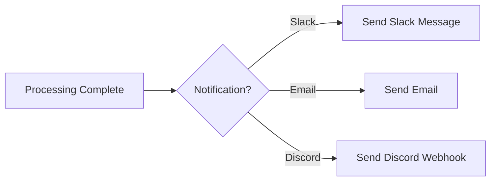

## 성능 고려사항

### 1. API 호출 최적화

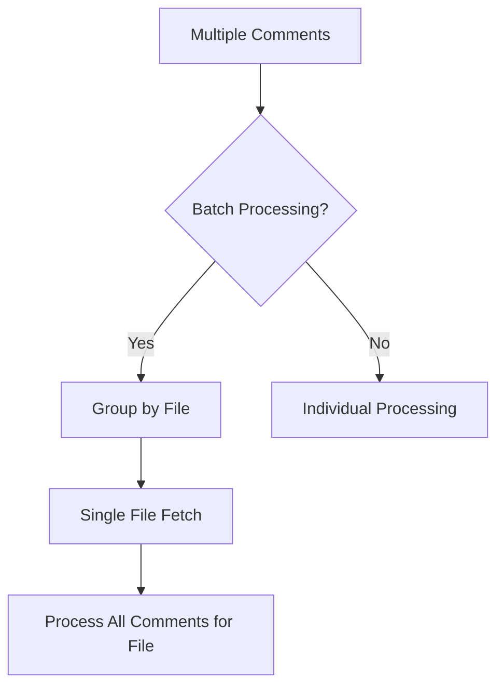

### 2. 토큰 사용량 관리

- 파일이 너무 큰 경우 관련 부분만 추출
- 컨텍스트 윈도우 고려
- 프롬프트 최적화

### 3. Git 작업 최적화

- 여러 수정사항을 단일 커밋으로
- 불필요한 푸시 방지
- 브랜치 상태 캐싱

## 보안 고려사항

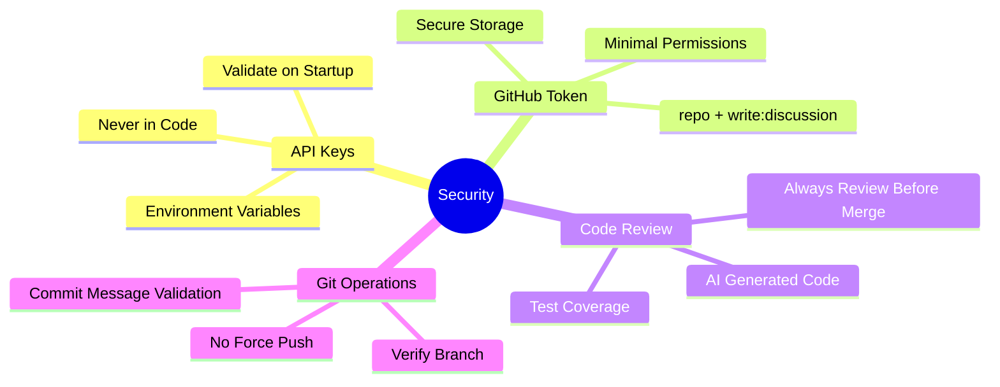

## 디렉토리 구조

```
pr-auto-reviewer/
├── main.py                 # CLI 진입점, 워크플로우 조율
├── config.py              # 설정 관리 및 검증
├── github_client.py       # GitHub API 래퍼
├── code_modifier.py       # 코드 수정 로직
├── git_ops.py            # Git 작업 자동화
│
├── models/               # AI 모델 구현
│   ├── __init__.py      # 모델 exports
│   ├── base.py          # 추상 인터페이스
│   ├── claude.py        # Claude (Anthropic) 구현
│   └── gemini.py        # Gemini (Vertex AI) 구현
│
├── pyproject.toml        # 프로젝트 메타데이터 및 의존성
├── .env.example          # 환경변수 템플릿
├── .gitignore           # Git 제외 파일
├── README.md            # 사용자 가이드
└── ARCHITECTURE.md      # 이 문서
```

## 의존성 그래프

```mermaid
graph TD
    main[main.py] --> config
    main --> github_client
    main --> code_modifier
    main --> git_ops
    main --> models_init[models/__init__.py]

    code_modifier --> models_base[models/base.py]
    models_init --> models_base
    models_init --> models_claude[models/claude.py]
    models_init --> models_gemini[models/gemini.py]

    models_claude --> models_base
    models_gemini --> models_base

    models_claude --> config
    models_gemini --> config
    github_client --> config

    main --> click
    main --> rich
    github_client --> PyGithub
    models_claude --> anthropic
    models_gemini --> vertexai
    git_ops --> GitPython
    config --> python_dotenv

    style main fill:#e1f5ff
    style config fill:#f0f0f0
    style models_base fill:#fff4e1
```

## 테스트 전략 (향후 추가)

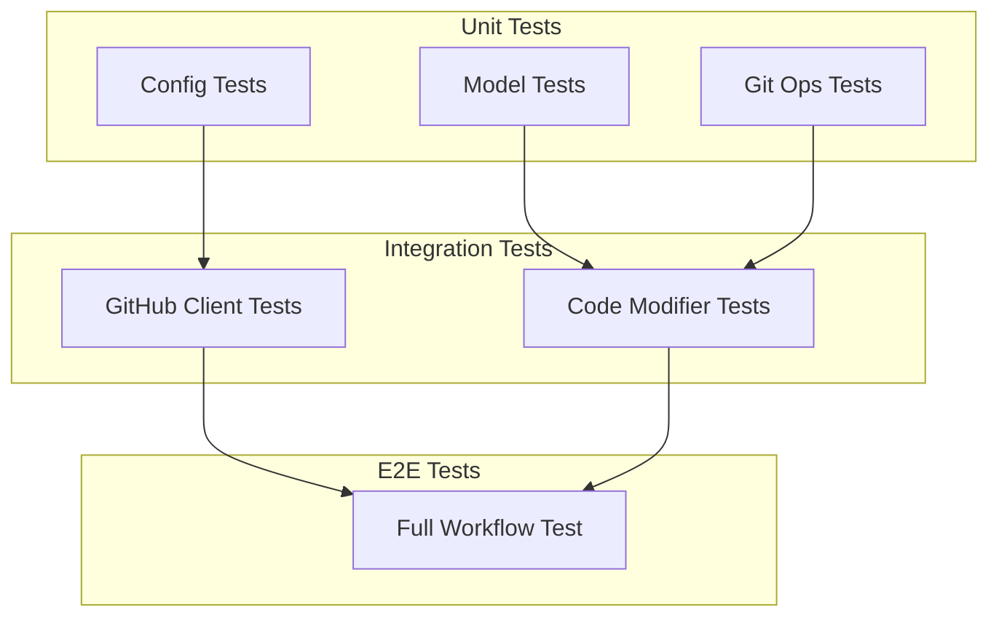

## 향후 개선 사항

1. **웹 인터페이스 추가**
   - FastAPI 기반 REST API
   - React 프론트엔드
   - 실시간 진행 상황 표시

2. **배치 처리**
   - 여러 PR 동시 처리
   - 큐 시스템 도입

3. **학습 및 개선**
   - 수정 이력 저장
   - 패턴 학습
   - 자동 개선

4. **알림 시스템**
   - Slack/Discord 연동
   - 이메일 알림

5. **분석 및 리포팅**
   - 처리 통계
   - 성공률 추적
   - 비용 모니터링
